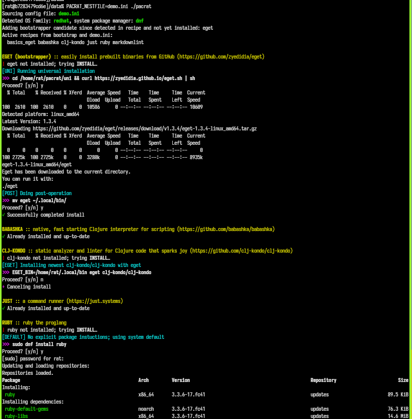
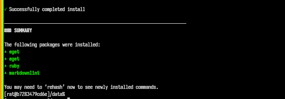

# Pacrat

> A minimal yet flexible **general-purpose package manager** for a variety of
> package types and OSs, geared toward installing and upgrading any CLI tool.
> Based on a single, shareable manifest INI file.


Pacrat does either of two simple things for any CLI-oriented package listed in
a `Nestfile`, depending on their state:

- _install_
- _upgrade_

What is a package? Almost anything!

## How it works

Pacrat utilizes your OS's base package manager (dnf, apt, brew, etc),
and also enables installation via [`eget`](https://github.com/zyedidia/eget),
`git-clone`, `docker/podman`, plus ad hoc via `curl/wget`, `gem`, `pip`,
whatever. This means that your team of developers can be spread across several
OSs and not have to worry about what/how to install/update tooling.

One of Pacrat's big values is in checking (invoking) each package to glean its
version and compare against _vermin_ to ensure that tooling is consistent
(up-to-date) across any machines that share a Nestfile.

Another great thing about Pacrat (much thanks to EGET and git) is that it
opens up the ability for any developer to throw a script/exe (or several) into
a tarball/zip or repo, post it as a Github "release", add it to the team
Nestfile with an `eget` or `clone` directive — and now the whole team is
immediately using the new tool without being told to do anything.

This makes Pacrat a tool well suited for use in a
[`post-checkout`](https://git-scm.com/docs/githooks#_post_checkout) git-hook.
So you likely want to set that up with something like
[Captain](https://github.com/MicahElliott/captain) or
[Lefthook](https://github.com/evilmartians/lefthook).

### Literate/executable setup doc

Pacrat can even do a "literate config" with a Markdown file (like a Python
Notebook) that contains `ini` fenced code-blocks. Those get auto-converted
on-the-fly to a Nestfile that Pacrat uses. So now your team's "getting
started" guide is something that can be executed (and optionally read)!

### Anti-features

Pacrat is a little like [Ansible](https://github.com/ansible/ansible), but much
simpler: controlled fully by a single INI-style config/manifest file (often shared
by a team) containing a list of packages, and run only locally.

Other anti-features:

- no package database — just a Nestfile
- no version pinning — just a minimum (`vermin`), to allow for native manager upgrades
- no uninstalls (for now)
- no writing to the Nestfile (for now, but may feature prompting to update `vermin`)
- no dependency logic: if you want Clojure, it's on you to specify Java before it

## Installation

Pacrat is just [a single `pacrat` script](./pacrat) that you can grab and put
on your `$PATH`.

```shell
mkdir -p ~/.local/bin
path+=~/.local/bin
cd ~/.local/bin # assuming this is on your PATH
curl -o pacrat https://raw.githubusercontent.com/MicahElliott/pacrat/refs/heads/main/pacrat
chmod +x pacrat
```

There are no install dependencies other than Zsh! Pacrat will bootstrap itself
with any necessary missing installers
([eget](https://github.com/zyedidia/eget), [podman](https://podman.io/),
unzip, wget, etc) on your first run. `pacrat` is a readable and tiny Zsh
script (500 lines, 20 kb).

## Spec file (`nest.ini`)

The package spec config/manifest file is a single `Nestfile` or `nest.ini`
(think of a rat's nest) with a declarative syntax that is simply a bunch of
sections representing individual packages. You create a `nest.ini` at the root
of your project repo to keep your team's packages up-to-date and in-sync. You
can even use it personally in your `~/nest.ini` to ensure every machine you
work on will have all your essentials installed.

Here are some package examples — first, a linter (`clj-kondo`):

```ini
[clj-kondo]
doc     = 'static analyzer and linter for Clojure code (https://github.com/clj-kondo/clj-kondo)'
cmd     = 'clj-kondo'
linux   = 'curl -sLO https://raw.githubusercontent.com/clj-kondo/clj-kondo/master/script/install-clj-kondo && chmod +x install-clj-kondo && ./install-clj-kondo'
brew    = 'borkdude/brew/clj-kondo'
verget  = 'clj-kondo --version | cut -f2 -d" "'
vermin  = '2024.11.14'
```

That section shows a package named `clj-kondo` and that:

- The installed command (`cmd`) is `clj-kondo`, which will be installed if not
  already present (or upgraded depending on `vermin`)
- On any _Linux_ system, `curl` is used to fetch and run an installer script
- On a _Macos_ system, a simple `brew install ...` is used
- The _version_ (`verget`) is obtained by running the tool and a little
  cut-parsing (though `pacrat` almost always can auto-infer it, so `verget` is
  rarely needed)
- An upgrade may be performed if the presently installed version is older
  (gleaned version is older than `vermin`)

See [`nest.ini`](./nest.ini) for an extensive runnable example.

A very minimal (typical) example for a command runner (`just`):

```ini
[just]
doc = 'a command runner'
```

Even the `doc` isn't needed — it could have been a single line: `[just]`.
Several implicit things happen here: After inferences, the actual spec
becomes:

```ini
[just]
cmd  = 'just'
pkg  = 'just'
brew = 'just'
dnf  = 'just'
apt  = 'just'
pkg  = 'just'
nix  = 'nixos.just' # nix-env -iA just
verget = '<...some magic...>'
```

So if those two are the extent of your `nest.ini`, now `clj-kondo` and `just`
will be installed by invoking `pacrat`:

```shell
% pacrat
Installing JUST...
```

Or if they are already installed, `pacrat` will prompt you to _upgrade_ them.

## What types of packages need Pacrat?

You already rely on your language's manager for libraries (`clj`,
`bundler/gem`, `pip`, `npm`, etc), but for anything that isn't handled by
those and isn't already on your system (and your colleagues' systems), you
have `pacrat`. Example tools are endless but categories include: linters, data
migrators, aws/github/etc CLIs, parsers, debuggers, and many more. Some tools
I personally like to have (up-to-date) on every system: `clj-kondo`, `cljfmt`,
`just`, `pgmig`, `direnv`, `clojure`, `markdownlint`, `podman`, `jq`,
`pgbouncer`, `ripgrep`, `sqlite`, `bat`, `curlie`, `dbeaver`, `fzf`, `redis`,
`ripgrep`, `yq`, `bbin`.

Many of those expected tools are necessary for keeping a sizeable project in
ship-shape, so you want eveyone on your team to have appropriate versions of
them installed. You can put a `nest.ini` at the root of every major project
you work on. Even though such a file generally covers a _system_, it shouldn't
be a conflict to have several of them if you work on multiple projects.

The workflow of keeping a team's fleet of systems up-to-date then is:

- Alice creates and adds a `nest.ini` file to a project's git repo at the top
  level

- Bob does a dnf/brew upgrade (or git-pull or eget or ...) and discovers that
  he's running a newer version of `just` than what's spec'd in `nest.ini`,
  so he adds the new version as `vermin`

- Carol pulls on the project (getting an update to `nest.ini`) and runs
  `pacrat` (maybe automatically via
  [captain](https://github.com/MicahElliott/captain), and is prompted to
  upgrade to the new `just` version that Bob put in

## Full Nestfile spec

Top level:

- `doc` — short description
- `details` — usually a link to project homepage
- `cmd` — the main CLI command that gets installed (its presence indicates it's already installed)
- `file` — used instead of `cmd` for special cases where no command is installed
- `path` — a `PATH` entry that will be added to your running shell and its RC file

Installer modes (most override each other depending on OS):

- `clone` — use `git` to pull down source and keep up-to-date; overrides all
- `clonedest` — set a specific clone destination to override `PACRAT_CLONE`
- `brew` — used when on a MacOS system and brew present
- `dnf` — used when on a RedHat-family system
- `apt` — used when on a Debian-family system
- `nix` — used when on a Nix-managed system
- `linux` — usually a `wget` or `curl`, untar/unzip, compile, `cp` sequence; overrides any `dnf`, `apt`, etc
- `macos` — same as `^^^` but for when running on mac; overrides `brew`
- `uni` — "universal" general purpose target that can have any shell commands
- `post` — a post-operation step performed after all others; can be done in any mode (eg, useful after a clone/pull)
- `upgrade` — special command for upgrading when standard package manager wouldn't know what to do
- `manual` — an instruction for how to manually get packages that cannot be auto-downloaded
- `instruct` — present a blocking user instruction to take action before proceeding with run

Versioning:

- `vermin` — ensure the package being installed is at least this new
- `verget` — optional, explicit way to help `pacrat` determine the currently installed version

## Excluding packages

Sometimes you don't want Pacrat to control a package on your system. Maybe
it's a tool you wrote and you want the rest of your team to clone it, but you
want your own checkout to be different. For this, you can use the CSV env var
`PACRAT_IGNORE`.

## Options

- `PACRAT_NESTFILE` — `.ini` file location
- `PACRAT_IGNORES` — CSV of packages to be ignored in `nest.ini`
- `PACRAT_NONINTERACTIVE` — set to anything to not be prompted before making changes
- `PACRAT_DRYRUN` — run without executing any install/upgrade commands
- `PACRAT_BASE` — base directory for clones, archives, etc (default `~/.pacrat`)
- `PACRAT_CLONE` — directory for git-clones (default `$PACRAT_BASE/clone`)
- `PACRAT_UNI` — directory for archives/extractions (default `$PACRAT_BASE/uni`)
- `PACRAT_BIN` — directory for binaries from eget (default `~/.local/bin`)

## Experimenting with OSs you use

If you're not ready to turn `pacrat` loose on your system just yet, try
running it in an isolated Podman container. A couple are already here for
testing: [Fedora](./Dockerfile-fedora) and [Ubuntu](./Dockerfile-ubuntu). For
example:

```shell
# Build a fedora container
% cd ~/path/to/pacrat/clone
% podman image build --rm -t  pacrat-fedora -f Dockerfile-fedora .

# Run it
% podman container run -it --rm --name myfedpacrat -v ~/path/to/pacrat/clone:/data:Z localhost/pacrat-fedora:latest

# Set a password for "rat" user to do sudo things, and log in
[root@b7283479cd6e]/data# passwd rat
[root@b7283479cd6e]/data# sudo -iu rat

# Run pacrat
[rat@b7283479cd6e]~% cd /data
[rat@b7283479cd6e]~% ./pacrat
Running PACRAT ...
```

## Alternatives

I explored several alternatives when considering whether to create Pacrat. In
the end, I decided Pacrat needed to exist since the following all had some
weaknesses for my use case, or were too complex to get a team up and running
quickly.

- [asdf](https://asdf-vm.com/)
- [nix](https://github.com/NixOS/nix)
- [flox](https://flox.dev/)
- [spack](https://github.com/spack/spack)
- zplug/zinit

## Demo



